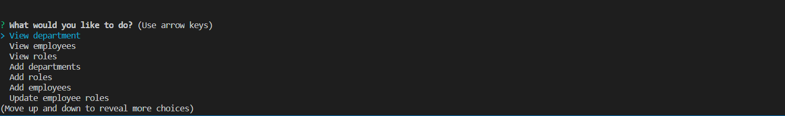
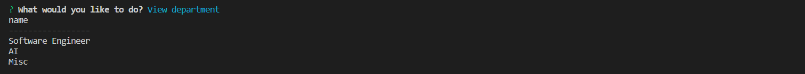
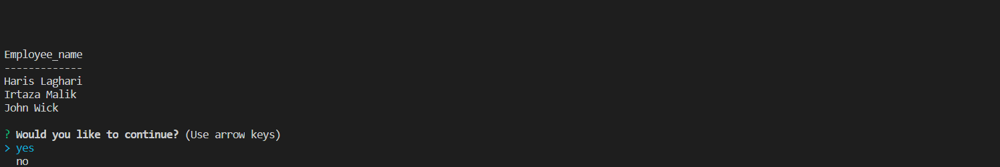
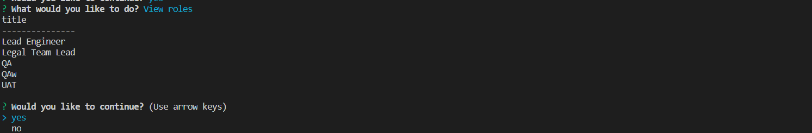
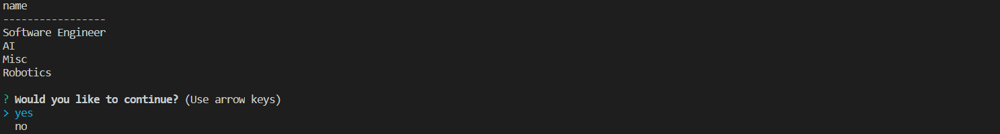
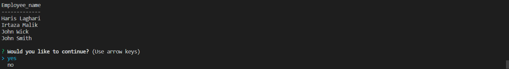

# Employee-Tracker
 This is an employee tracker to keep track of you all employees. This application can add employee, department & role. Similarly it can delete employee, department & role. It can update role as well. You can also view total budget of all departments in it.  You can view all employes, department, role by name & view everything of employee, department & role.

## Installation
Git clone the repo on your local computer and run app.js in Git bash shell. Use the username & password in "app.js" to connect to database. In MySQL Workbench use schema.sql to create table & seeds.sql to populate data.

## Usage 
Go to open Bash 

Do NPM i & press enter

Do NPM i console.table & press enter

Do NPM i inquirer & press enter

Write node app.js & press enter & make selection 

View Department 

View Employees 

View Roles 

Add Department by writing its name

Department Added 

Add Employee by wrting name & selecting role 

Employee added 

